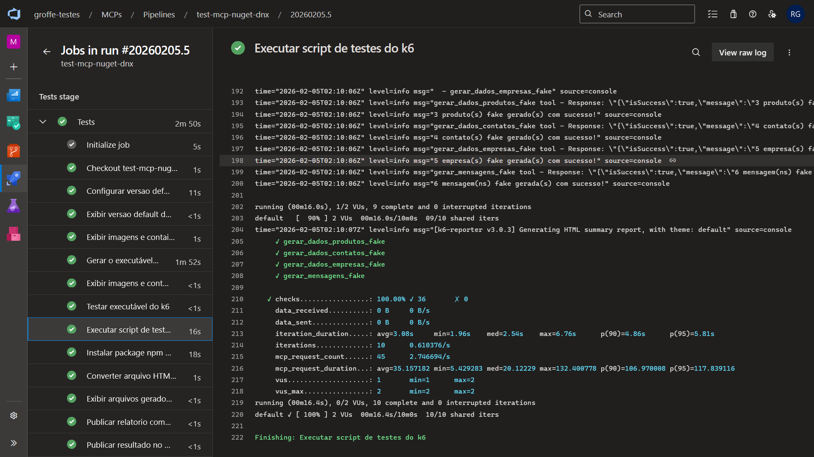
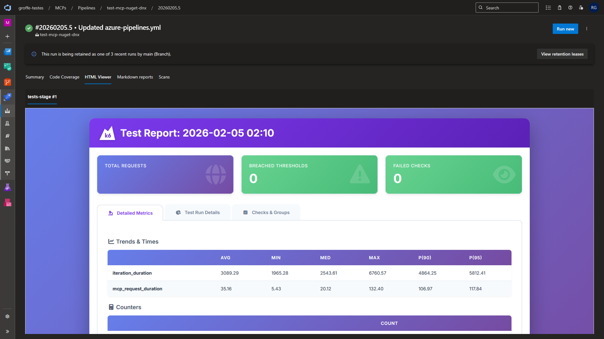
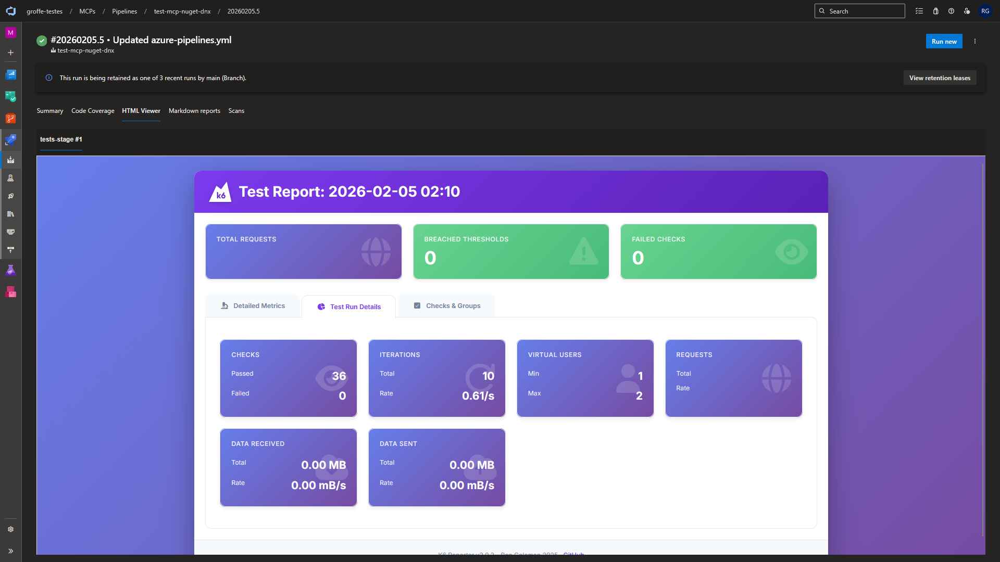
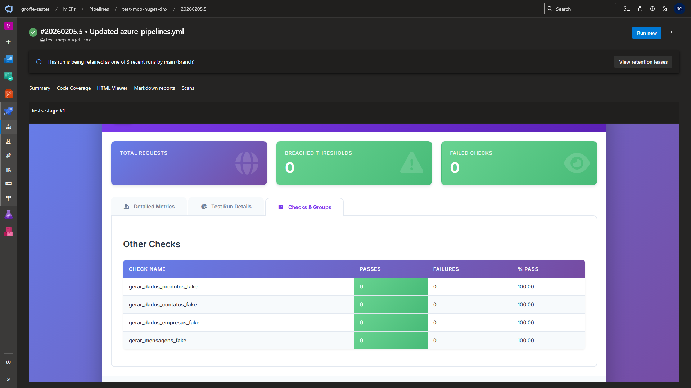

# k6-mcps-tests-dnx-azdevops-pipelines
Exemplo de implementação de testes de validação com k6 para MCP Servers acionados via dnx (.NET 10) e que inclui execução automatizada a partir de um pipeline do Azure DevOps. Inclui o build do executável do k6 com a extensão para MCPs via container.

Extensão do k6 para MCP: https://github.com/grafana/xk6-mcp

Package NuGet utilizado nos testes: https://www.nuget.org/packages/FakeDataMcpServer/

Projeto que serviu de base para a geração deste package: https://github.com/renatogroffe/dotnet10-nuget-mcp-fakedata

---

## Resultados da execução dos testes

Testes executados via pipeline (em ambiente Linux):

Relatório HTML com resultados do k6 - Métricas:

Relatório HTML com resultados do k6 - Detalhes da Execução:

Relatório HTML com resultados do k6 - Validações/Checks:

Resultados no formato Markdown:

